# Part 7 - Configuration Management Setup

In this section, we will do configuration management setup to help us in the upcoming CD stages

This is a **very important step**, so please follow as closely as possible

## Objectives

On AWS:

- [Create a Key-Pair](#create-a-key-pair)
- [Create IAM user for programmatic access](#create-iam-user-for-programmatic-access)
- [Create a publicly accessible PostgreSQL database in RDS](#create-a-publicly-accessible-postgresql-database-in-rds)
- [Create the initial CloudFront distribution](#create-the-initial-cloudfront-distribution)

On CircleCI:

- [Add SSH Key](#add-ssh-key)
- [Set Environment Variables](#set-environment-variables)

On CircleCI Config:

- [Add installation commands](#add-installation-commands)

## AWS Set Up

It's important to select a region for our deployment, where all of our regional resources will reside

In this guide I will use the **US West - Oregon (us-west-2)** region

### Create a Key-Pair

- On AWS Management Console navigate to `EC2` > `Key Pairs` > `Create key pair`

- Use the following values:

  - Name: `udacity` or any name you see fit, **it will matter**
  - Private key file format: `.pem (For use with OpenSSH)`

    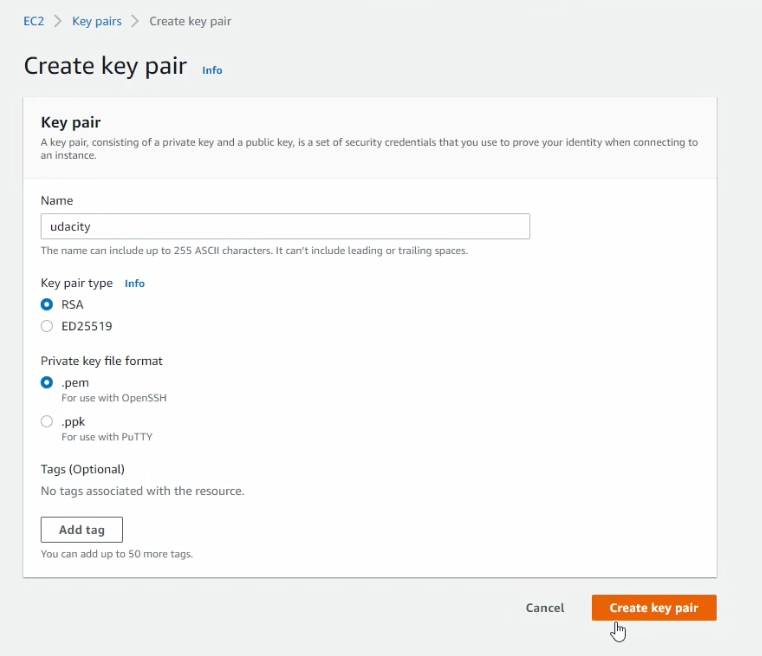

- Click Create key pair

**Save the downloaded `udacity.pem` file in a safe location as we'll use it extensively from now on**

### Create IAM user for programmatic access

We need to create an IAM user with programmatic credentials to enable CircleCI do actions on our AWS account on our behalf during the CI/CD Pipeline

#### Creating the user on AWS Management Console

- On AWS Management Console navigate to `IAM` > `Users` > `Add users`

- In the first page of user details use the following values:

  - User name: `udapeople-circleci-runner` or any name you see fit, **it won't matter much**
  - Select AWS credentials type: **check** `Access key - Programmatic access`

    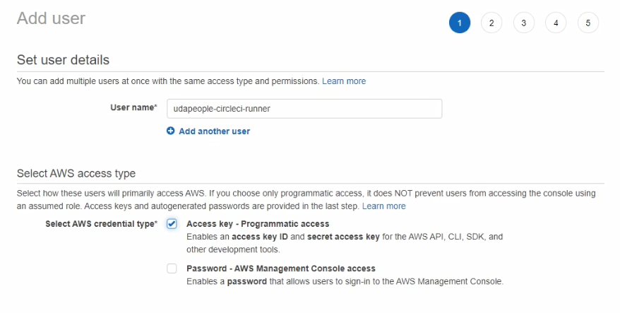

- In the second page of user details, for simplicity add the user to the group with admin privileges (if you have one), or simply attach the `AdministratorAccess` directly to the user

  

- Continue page 3 and page 4 as they are and create a user

- On page 5 download the CSV file containing the new user's credentials

  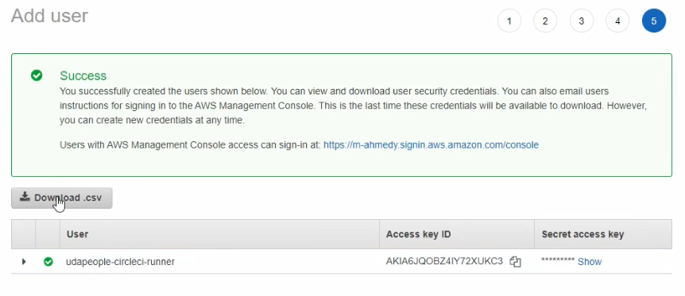

#### Saving profile info on our local AWS CLI

We will save the user credentials in a separate profile (will name it `udapeople`) to be able to use it with the CLI

The following commands are executed on our local PC

To save user credentials as a new profile (`udapeople`)

```sh
$ aws configure --profile udapeople
AWS Access Key ID [None]: Access Key
AWS Secret Access Key [None]: Secret Access Key
Default region name [None]: us-west-2
Default output format [None]: json
```

Then to check credentials are valid we type the following command

```sh
aws sts get-caller-identity --profile udapeople
```

We shall have an output similar to this

```json
{
  "UserId": "ABCDEFGHIJKLMNOPQRSTU",
  "Account": "123456789123",
  "Arn": "arn:aws:iam::13456789123:user/udapeople-circleci-runner"
}
```

This means the user is now ready

### Create a publicly accessible PostgreSQL database in RDS

We need to create a publicly accessible RDS instance with minimal cost to hold our application data

#### Security Group for PostgreSQL traffic

- On AWS Management Console navigate to `EC2` > `Security Groups` > `Create security group`

- Add an inbound rule for `PostgreSQL` from `Anywhere` (basically Protocol: `TCP`, Port: `5432`, Source: `0.0.0.0/0`)

  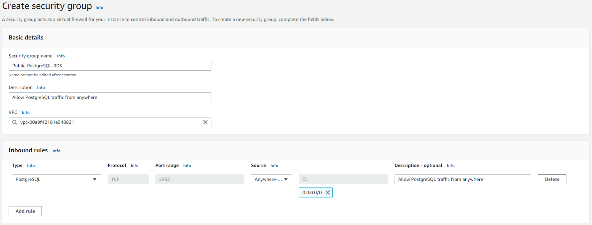

- Leave everything else as it's and click create

#### Create an RDS Instance

**Please follow this section very carefully to avoid DB problems in the upcoming stages**

- On AWS Management Console navigate to `RDS` > `Databases` > `Create database`

- In the first card choose `Standard Create`, and in **Engine** options choose `PostgreSQL` with the **default** version

  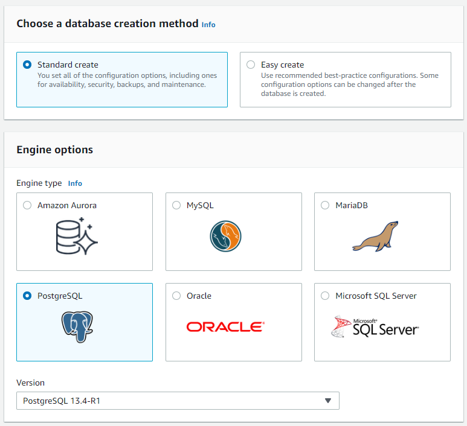

- In **Templates** choose `Free tier`, and you'll see that you're restricted to `Single DB instance` in the next card

  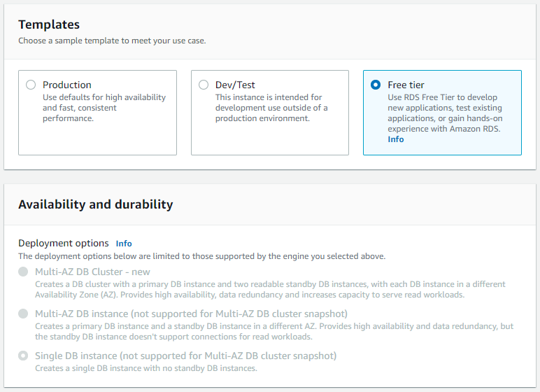

- In Settings choose a name for your instance identifier (`udapeople-db`)

- Under **credentials** choose a username and a password (username: `postgres`, password: Check `Auto generate a password`)

- In **Instance configuration** you can select any available option (`db.t4g.micro`)

  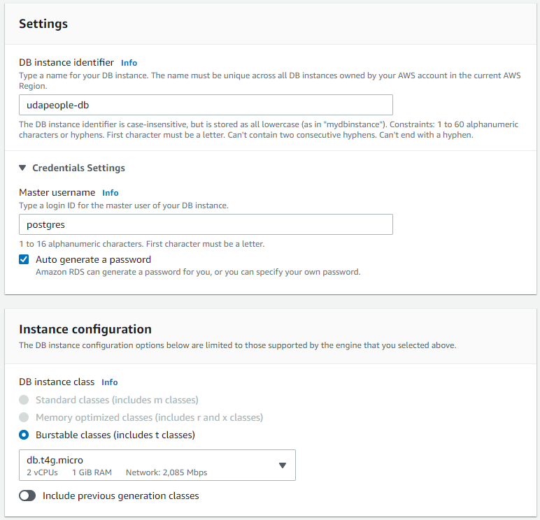

- In Storage make sure to **uncheck** `Enable storage autoscaling`

  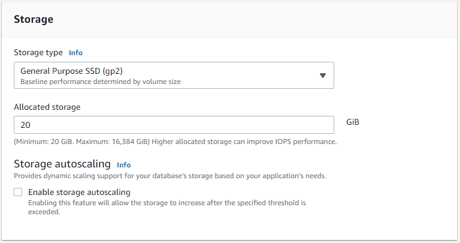

- **Important**: In **Connectivity** make sure you choose the correct values

  - **VPC**: `Default VPC`
  - **Subnet group**: `default`
  - **Public access**: `Yes`
  - **VPC Security Group**: `Choose existing`
    - **Remove** `default`
    - **Add** the security group created in the previous step (`Public-PostgreSQL-RDS`)
  - **Availability Zone**: `No preference`
  - **Additional configuration**:
    - Database port: `5432`

  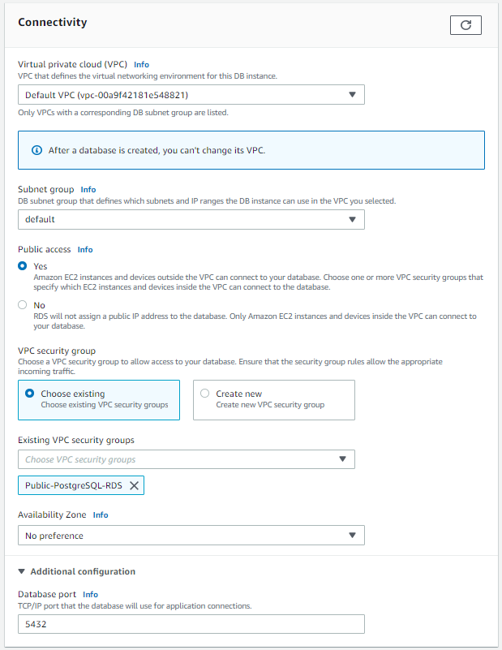

- In **Database authentication** choose `Password authentication`

- **Important**: Open the Additional configuration card

  - In Database options set **Initial database name** to a value (`glee`)

    The same value here will be the **TYPEORM_DATABASE** environment variable

    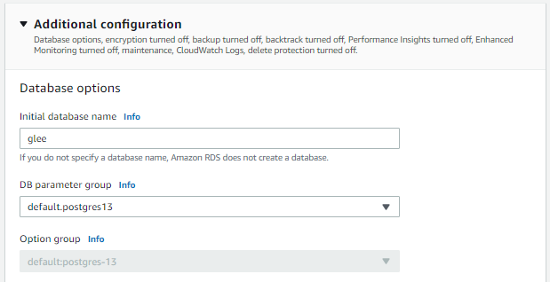

  - Optional: You can disable **Encryption**, **Backup**, **Monitoring**, and other checked features
    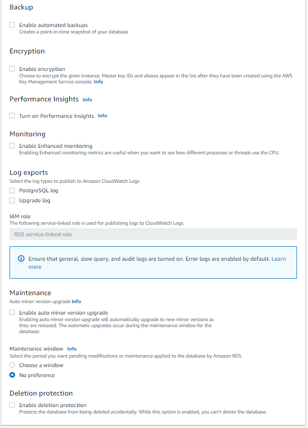

- Finally, create a database

If you checked Auto generate password you'll have a prompt with a blue ribbon in the next page


Click on `View credentials settings` and save the username and password in a safe location

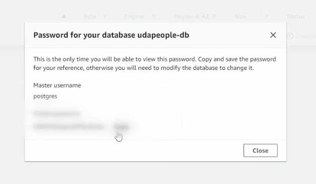

### Create the initial CloudFront distribution

First we need to think of a random string (7 characters), this will be a unique identifier for our initial distribution and its origin bucket

Think of something like `k0aehenb`, but always think of alternatives in case a string is already taken

#### Create S3 origin bucket

- On AWS Management Console navigate to `S3` > `Buckets` > `Create bucket`

- For **Bucket name** write `udapeople-k0aehenb`

- For **AWS Region** use the same region where we are developing the app (`us-west-2`)

  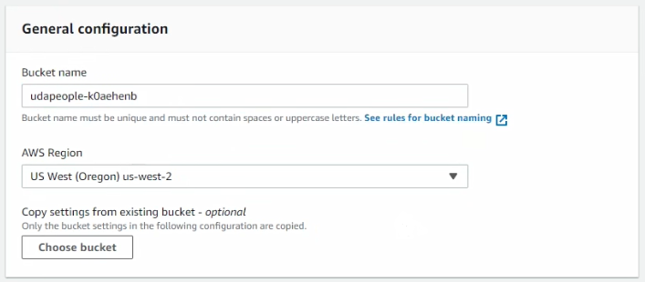

- Remember to **uncheck** `Block all public access`, and **check** the `I acknowledge` checkbox

  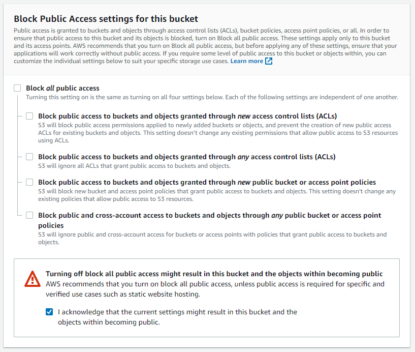

- Keep everything as is and create the bucket

- Navigate to the `Permissions` tab of bucket details, and update the bucket policy, also remember to change the bucket ARN to that of the created bucket

  ```json
  {
    "Version": "2012-10-17",
    "Statement": [
      {
        "Sid": "PublicRead",
        "Effect": "Allow",
        "Principal": "*",
        "Action": ["s3:GetObject", "s3:GetObjectVersion"],
        "Resource": ["arn:aws:s3:::udapeople-k0aehenb/*"]
      }
    ]
  }
  ```

- Save the new policy, and now you can see that the bucket is publicly accessible

  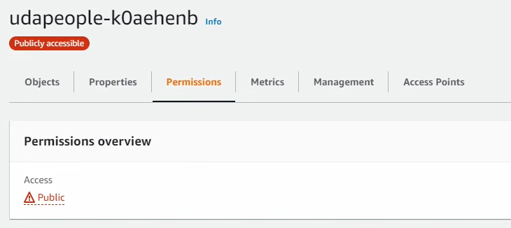

- You can also enable static site hosting on this bucket, but it's unnecessary as it's only a placeholder

#### Create CloudFront distribution

Now we can create a CloudFront distribution and use the created bucket as the origin

##### Looking inside the CloudFront template

Inside the CloudFront template (.circleci/files/cloudfront.yml), we can see that it takes in a string parameter named `WorkflowID`

```yaml
Parameters:
  WorkflowID:
    Description: Unique identifier.
    Type: String
```

This parameter is used in two places inside the template

- As an identifier for the origin bucket

  ```yaml
  WebpageCDN:
    Type: AWS::CloudFront::Distribution
    Properties:
    DistributionConfig:
      Origins:
        - DomainName: !Sub "udapeople-${WorkflowID}.s3.amazonaws.com"
  ```

  Take a look at the bucket endpoint, the bucket should always be named in this format `udapeople-<Unique ID>`

- And as an output to indicate what version the CloudFront distribution is currently serving

  ```yaml
  Outputs:
    WorkflowID:
      Value: !Sub ${WorkflowID}
      Export:
        Name: WorkflowID
  ```

Now we can use the previous knowledge and create the first CloudFront distribution

```sh
cd .circleci/files
aws cloudformation deploy \
    --template-file cloudfront.yml \
    --stack-name udapeople-cloudfront \
    --parameter-overrides WorkflowID=k0aehenb \
    --profile udapeople
```

Then let the terminal open until the stack is created

## CircleCI Set Up

### Add SSH Key

- On CircleCI project navigate to `Project Settings` > `SSH Keys` > `Additional SSH Keys`

  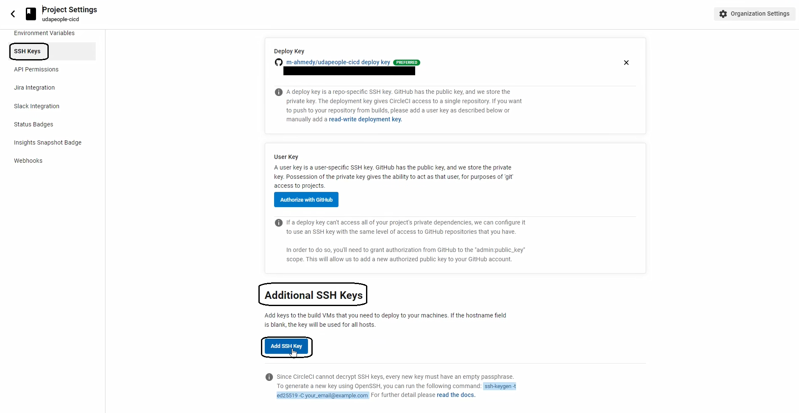

- In the dialog enter a `Hostname` for the key

- Open the downloaded `udacity.pem` key file in a text editor and copy all its contents, and paste it in the `Private key` field

- Create SSH Key

You can now see the SSH fingerprint of the key


Keep in mind as we'll need it in later stages

### Set Environment Variables

On CircleCI project navigate to `Project Settings` > `Environment Variables` and add the following variables (without < > characters)

```
AWS_ACCESS_KEY_ID=<From the new user .csv>
AWS_SECRET_ACCESS_KEY=<From the new user .csv>
AWS_DEFAULT_REGION=us-west-2 # Or the region you are using for development

TYPEORM_CONNECTION=postgres
TYPEORM_MIGRATIONS_DIR=./src/migrations
TYPEORM_ENTITIES=./src/modules/domain/**/*.entity.ts
TYPEORM_MIGRATIONS=./src/migrations/*.ts

# From RDS Instance properties
TYPEORM_HOST=<RDS Instance Endpoint> # Without https in front
TYPEORM_PORT=5432
TYPEORM_USERNAME=postgres # Or the username you chose
TYPEORM_PASSWORD=<Auto generated> # Or the password you chose
TYPEORM_DATABASE=<RDS Initial database name, Again NOT DB Instance Identifier>
```

## CircleCI config

For CD Stages we will use a base image from CircleCI that supports the tools we shall use: Ansible, AWS CLI, etc.

We will use [`cimg/base:stable`](https://circleci.com/developer/images/image/cimg/base), it's a base convenience image provided by CircleCI built upon Ubuntu that's ready to run all types of software

We will add some updates to the `commands` section to install necessary tools

### Add installation commands

In `.circleci/config.yml` commands section we add the following commands

- To install AWS CLI v2 ([this guide](https://docs.aws.amazon.com/cli/latest/userguide/getting-started-install.html))

  ```yaml
  install_awscli:
    description: Install AWS CLI v2
    steps:
      - run:
          name: Install AWS CLI v2
          command: |
            curl "https://awscli.amazonaws.com/awscli-exe-linux-x86_64.zip" -o "awscliv2.zip"
            unzip awscliv2.zip
            sudo ./aws/install
  ```

- To install Ansible ([this guide](https://docs.ansible.com/ansible/latest/installation_guide/intro_installation.html))

  We need to make sure that `python3` and `pip3` are installed before installing ansible

  ```yaml
  install_ansible:
    description: Install Ansible
    steps:
      - run:
          name: Install Ansible
          command: |
            sudo apt update
            sudo apt install -y python3 python3-pip
            python3 -m pip install --user ansible
  ```

## Footnotes

_Note_ If you decided to use another docker image for the CD stages remember the following points:

- AWS CLI v2 **does not work** with Alpine based images, for the sake of this project, continue with Debian / Ubuntu based images as they are much easier to prepare

Now we are ready to continue developing CD stages
